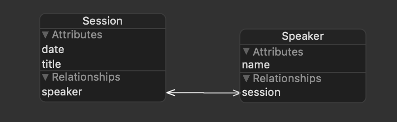

# Adding Core Data

These are notes on how to go from the `master` branch to `feature/add-core-data` branch. This was done live by Zev at Learn Swift Boston on August 15, 2019.

## Creating the model

Here, we create the Core Data model structure. Xcode works some magic behind the scene to create an class we can interact with in the code.

1. Create a Core Data file called "Model".
2. Added two entitities `Session` and `Speaker`.
  - `Speaker` only has a name attribute.
  - `Session` has title and date attributes.
  - `Session` and `Speaker` were each given a relationship to the other, and marked as "Inverse".

Here is the overall structure we created.

## DataStore

We now want to create a class that interacts with Core Data inlcuding creating a "context" with the `Speaker` and `Session` objects and to save the data.

1. Create a new Swift file called "DataStore".
2. We created a singleton `DataStore` object for this demo because it simplifies the app, but it is not best preactice in production.
3. A private `init()` was created to prevent accidental initializations elsewhere in the app.
4. `persistentContainer: NSPersistentContainer` was created and it loads the stored data.
5. The `saveContext()` method saves `persistentContainer.viewContext` if there are changes.

## Adding Core Data to AddSpeakerViewController

All we need to do is save the input speaker's name as a new Speaker in `DataStore`.

1. In the `addTapped(_:)` function, a new speaker was created from the shared managed object context
2. The speaker's name was set as the text from the speaker text field.
3. The view was dismissed and the Core Data context was saved.

## Adding Core Data to AddSessionViewController

To implement Core Data here, we need to save the title, speaker, and date of the session. Here, we learn how to retrieve data from a Core Data model since we want to create a picker view with the speaker's names.

1. Two new variables were created to hold the index of the selected speaker and date. The selected date vairable has a `didSet` watcher to change the text in the `dateField` text field.
2. `fetchedResultsController: NSFetchedResultsController<Speaker>` was created; `NSFetchedResultsController` is "A controller that you use to manage the results of a Core Data fetch request and to display data to the user," ([doc](https://developer.apple.com/documentation/coredata/nsfetchedresultscontroller)).
  - The fetch request is "A description of search criteria used to retrieve data from a persistent store," ([doc](https://developer.apple.com/documentation/coredata/nsfetchrequest)). Its `sortDescriptors` property accepts an array of `NSSortDescriptor` for sorting the data; here, the speakers are sorted alphabetically.
  - The fetch request and managed object context is then used to create the fetched results controller.
  - The controller performs a fetch (which throws) and returns the controller.
3. The date picker was set up in the `viewDidLoad` by adding a target and mode. The target is `datePicked(_:)` and was added in an extension to the class.
4. The next step is to add Core Data to the `addTapped` function that responds to the "+" button being tapped in the UI.
  - The guard statement at the top is expanded to include all of the inputs.
  - A new session is created from the DataStore managed object context and the title and date are set.
  - The view is dismissed and the data is saved.
4. The picker view to select the speaker is set up in a simillar fashion as a `UITableView`.
  - The number of rows is just the number of possible speakers, which is the number of objects in the fetched results controller's fetched objects array.
  - The title for each row is the name of the speaker at the index. This is again taken from the fetched results controller's fetched objects array.
  - When the user selects a row, the `selectedSpeakerIndex` and `speakerField.text` is updated to reflect the choice.

## Adding Core Data to SessionsViewController

Finally, we want to present the sessions. Like above, we must fetch the sessions from our Core Data model. We also want to make this table view "reactive" to changes in `DataStore.shared` so it is updated as sessions are added.

1. Just like in the `AddSessionViewController`, the first step is to make a `NSFetchedResultsController`, bu this time to retrieve the sessions. The process is simillar to before, though this time, we set the delegate of the `fetchedResultsController` to `self`.
2. To be the delegate, `SessionViewController` must conform to `NSFetchedResultsControllerDelegate`. There are no functions that must be added, though we add `controllerDidChangeContent(_:)` to reload the table's data if there are new sessions.
3. The last step is to address the `UITableViewDataSource` and `UITableViewDelegate` functions.
  - `numberOfSections(in:) -> Int` should return 1 because we are not separating the sessions into sections.
  - `tableView(_:numberOfRowsInSection) -> Int` needs to return the number of sessions which is the number of items in the fetched results controller's fetched objects array.
  - `tableView(_:cellForRowAt:) -> UITableViewCell` updates the dequeued `SessionTableViewCell` and updates it's fields with information from the session.

